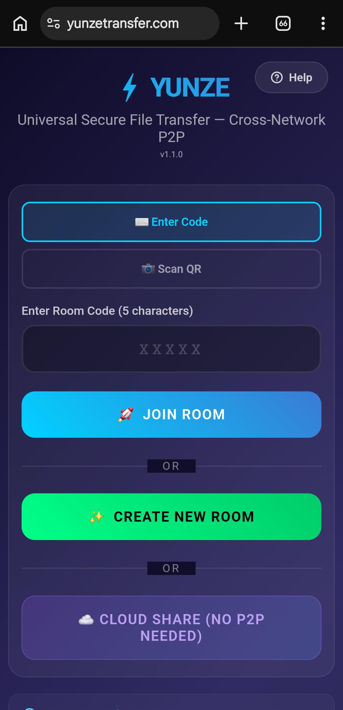
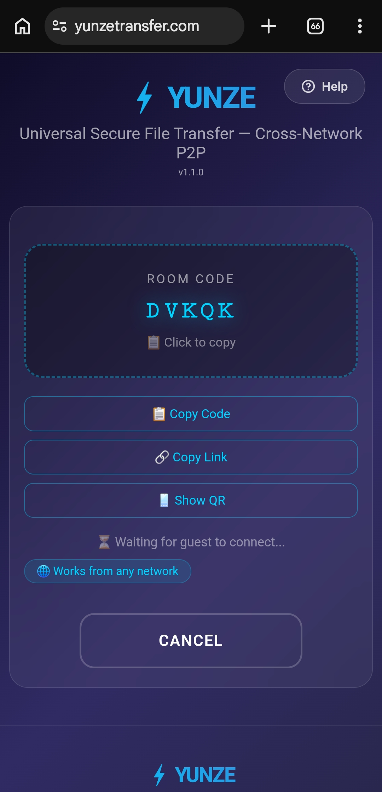
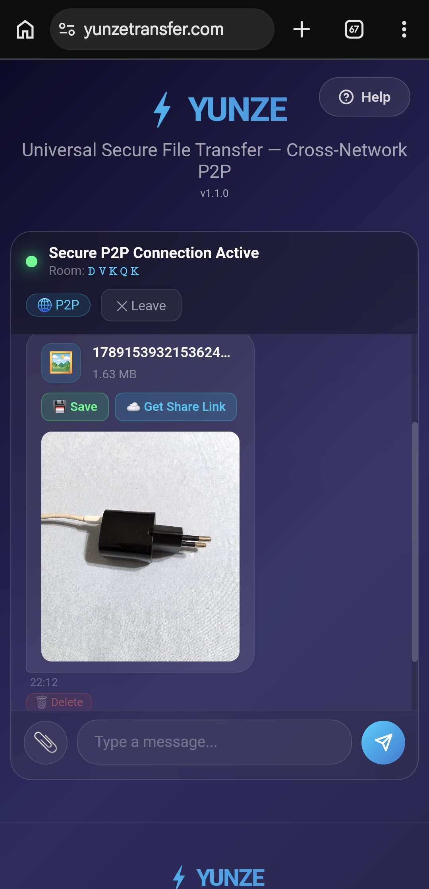

<div align="center">
  

  # ⚡ Yunze Universal Transfer

  **Free, private, peer-to-peer file sharing — no accounts, no servers, no size limits.**

  [](LICENSE)
  [](https://yunzetransfer.pages.dev)

  🔗 **Live app:** [yunzetransfer.pages.dev](https://yunzetransfer.pages.dev)
</div>

---

## Table of Contents

- [What is Yunze?](#what-is-yunze)
- [Screenshots](#screenshots)
- [Features](#features)
- [How It Works](#how-it-works)
  - [Peer-to-Peer Transfer](#peer-to-peer-transfer)
  - [Cloud Share (Fallback Mode)](#cloud-share-fallback-mode)
- [Architecture](#architecture)
- [Tech Stack](#tech-stack)
- [Project Structure](#project-structure)
- [Running Locally](#running-locally)
- [Deployment](#deployment)
- [Security & Privacy](#security--privacy)
- [SEO / Static Pages](#seo--static-pages)
- [Android App](#android-app)
- [Browser Compatibility](#browser-compatibility)
- [Roadmap](#roadmap)
- [FAQ](#faq)
- [Contributing](#contributing)
- [License](#license)
- [Contact](#contact)

---

## What is Yunze?

Yunze is a browser-based file transfer tool that sends files **directly between two devices** using WebRTC, a real-time communication standard built into every modern browser. Unlike traditional file-sharing services (WeTransfer, Google Drive, Dropbox), Yunze never uploads your file to a server — it establishes a direct, encrypted connection between the sender and receiver, and the file travels straight from one device to the other.

This means:
- No file size limits imposed by a server
- No waiting for uploads before the recipient can start downloading
- No third party ever has a copy of your file
- No account, no login, no personal data collected

## Screenshots

| Home | Room Code | Active Transfer |
|------|-----------|------------------|
|  |  |  |

## Features

- 🔗 **True peer-to-peer transfer** — WebRTC data channels, encrypted with DTLS by default
- 🚀 **No file size limits** — files are streamed in ~64KB chunks directly between devices
- 🌍 **Cross-network support** — works across WiFi ↔ 4G/5G, and across different countries/ISPs
- 🔑 **Simple pairing** — join with a 5-character room code, or scan a QR code
- 📱 **Mobile-friendly UI** — fully responsive, works from any modern mobile or desktop browser
- ☁️ **Cloud Share (optional fallback)** — when both devices can't be online simultaneously, upload the file via **gofile.io** or **Telegram** and share a plain download link instead
- 🛡️ **Privacy-first by design** — no accounts, no file logging, no analytics tracking file content
- 📄 **In-chat file preview** — images and common file types render inline before download
- 🌐 **SEO-friendly static pages** — About, Privacy Policy, P2P Guide, and Security Guide are real crawlable pages, not JS-only overlays

## How It Works

### Peer-to-Peer Transfer

1. **Device A** creates a room and receives a short room code (e.g. `DSIMS`) and/or a QR code.
2. **Device B** enters that code (or scans the QR) to join the same room.
3. A **signaling server** (provided by [PeerJS](https://peerjs.com)) helps the two devices discover each other's network information — this is the *only* role the server plays. It never sees file contents.
4. Once matched, the browsers negotiate a **direct WebRTC connection** using ICE (Interactive Connectivity Establishment), attempting a direct peer connection first and falling back to a TURN relay only if a direct path is blocked by strict firewalls/NAT.
5. The file is split into small chunks and streamed directly over the WebRTC **DataChannel**, encrypted end-to-end via DTLS.
6. When the transfer finishes (or the tab is closed), the connection is torn down — nothing persists anywhere.

> 📖 For a deeper technical explanation, see the in-app [P2P Guide](https://yunzetransfer.pages.dev/p2p.html).

### Cloud Share (Fallback Mode)

Sometimes both people can't be online at the exact same time. For this case, Yunze offers an **optional** "Cloud Share" mode:

| Provider | Limit | Retention | Notes |
|----------|-------|-----------|-------|
| **gofile.io** | No hard limit | ~10 days of inactivity | Public download link, third-party hosted |
| **Telegram** | 50MB per file | Until removed from the storage channel | Uses the Telegram Bot API to store files and generate a direct file link |

This mode is entirely opt-in — the default and recommended way to use Yunze is direct P2P transfer.

## Architecture

```
┌─────────────┐      signaling only       ┌─────────────┐
│  Device A   │ ─────────────────────────▶│   PeerJS    │
│  (Sender)   │◀───────────────────────── │  Signaling  │
└──────┬──────┘                            └─────────────┘
       │                                          ▲
       │         direct WebRTC DataChannel        │
       │        (file chunks, DTLS encrypted)      │
       ▼                                          │
┌─────────────┐                                    │
│  Device B   │◀───────────────────────────────────┘
│ (Receiver)  │      (signaling handshake only)
└─────────────┘
```

The signaling server is only involved in the initial handshake. All file data flows through the direct connection at the center of the diagram.

## Tech Stack

- **Frontend:** Vanilla JavaScript, HTML5, CSS3 — no framework, no build step, no bundler
- **P2P layer:** [PeerJS](https://peerjs.com) (WebRTC wrapper + signaling)
- **Hosting:** [Cloudflare Pages](https://pages.dev) (static hosting, global CDN)
- **Optional cloud fallback:** [gofile.io](https://gofile.io) API, [Telegram Bot API](https://core.telegram.org/bots/api)

## Project Structure

```
├── index.html            # Main single-page app (room creation, transfer UI, Cloud Share)
├── app.js                 # Core logic: WebRTC/PeerJS handling, file chunking,
│                           #   Cloud Share uploads (gofile/Telegram), UI state
├── styles.css              # All styling, responsive breakpoints
├── about.html               # Standalone "About" page (SEO-crawlable)
├── privacy.html              # Standalone Privacy Policy page
├── p2p.html                   # Standalone "What is P2P?" guide
├── security.html                # Standalone security best-practices guide
├── sitemap.xml                   # XML sitemap for search engine indexing
├── manifest.json                  # PWA manifest (name, icons, theme color)
├── favicon.ico / yunze-icon.png    # App icons
├── _redirects                       # SPA fallback routing rule
├── netlify.toml                      # Legacy Netlify config (kept for reference)
├── LICENSE                             # MIT License
└── README.md                            # This file
```

## Running Locally

This is a fully static site — no build tools, no `npm install`, no compilation step required.

```bash
git clone https://github.com/<your-username>/Yunze-Transfer.git
cd Yunze-Transfer

# Option 1: Python
python3 -m http.server 8000

# Option 2: Node.js
npx serve .

# Option 3: PHP
php -S localhost:8000
```

Then open `http://localhost:8000` in your browser. To test P2P transfer, open the app in two separate browser tabs (or two devices on the same network) and connect them via a room code.

> ⚠️ **Note:** WebRTC generally requires either `localhost` or HTTPS to function — testing across two *different* physical devices on your local network may require serving over HTTPS or using a tunneling tool like `ngrok`.

## Deployment

The live site is deployed via **Cloudflare Pages**, connected directly to this GitHub repository:

1. Push changes to the `main` branch
2. Cloudflare Pages automatically detects the change and builds a new deployment
3. No build command is needed — it's served as static files directly

To deploy your own fork:
1. Fork this repository
2. Go to [Cloudflare Pages](https://pages.dev) → **Create a project** → **Connect to Git**
3. Select your fork, leave build settings empty (static site), and deploy

## Security & Privacy

- **No server-side file storage** — by default, files never touch any server; they move directly between the two connected devices.
- **Encryption in transit** — WebRTC DataChannels are encrypted using DTLS, the same class of encryption used to secure HTTPS.
- **No accounts, no tracking** — Yunze does not require sign-up, does not use cookies, and does not log file names, sizes, or transfer metadata.
- **Cloud Share caveat** — if you opt into gofile.io or Telegram upload, your file is stored on that third-party's infrastructure and is subject to their respective policies. This mode is clearly optional and separate from the default P2P mode.

Full details: [Privacy Policy](https://yunzetransfer.pages.dev/privacy.html) · [Security Guide](https://yunzetransfer.pages.dev/security.html)

## SEO / Static Pages

Because the core app is a single-page application, secondary content (About, Privacy, P2P Guide, Security Guide) is built as **separate standalone HTML files** rather than JavaScript-only overlays. Each page has its own `<title>`, meta description, canonical URL, and Open Graph tags, so search engines can crawl and index them independently — not just the main app screen.

## Android App

A packaged Android APK (built via a WebView wrapper) is available under [**Releases**](../../releases). It loads the live web app inside a native Android shell.

## Browser Compatibility

Yunze relies on the WebRTC API, which is supported in all modern browsers:

| Browser | Supported |
|---------|-----------|
| Chrome / Edge (desktop & mobile) | ✅ |
| Firefox | ✅ |
| Safari (iOS 11+ / macOS) | ✅ |
| Samsung Internet | ✅ |
| Internet Explorer | ❌ Not supported |

## Roadmap

- [ ] Multi-file / folder transfer in a single session
- [ ] Transfer resume after a dropped connection
- [ ] Optional end-to-end file encryption layer on top of DTLS
- [ ] Additional Cloud Share providers

## FAQ

**Are my files stored on your servers?**
No. Files transfer directly between devices (peer-to-peer) and are never stored on Yunze servers. The optional "Upload & Get Link" feature lets you choose gofile.io or Telegram for one-way sharing — in that case, the file is stored by that third-party service, not by Yunze.

**Is there a file size limit?**
No hard limit for direct P2P transfer — very large files may simply take longer depending on both devices' connection speeds. The optional Telegram Cloud Share mode has a 50MB cap (a limitation of the Telegram Bot API).

**Do both people need to be online at the same time?**
For direct P2P transfer, yes. If that's not possible, use the Cloud Share fallback instead.

**Is it really free?**
Yes, completely — no subscriptions, no premium tier, no ads.

## Contributing

Contributions, bug reports, and feature suggestions are welcome. Feel free to open an issue or submit a pull request.

## License

This project is licensed under the [MIT License](LICENSE) — you're free to use, modify, and distribute it, provided the original copyright notice is retained.

## Contact

For questions, feedback, or partnership inquiries, reach out via [Instagram @yunze_official](https://www.instagram.com/yunze_official).
